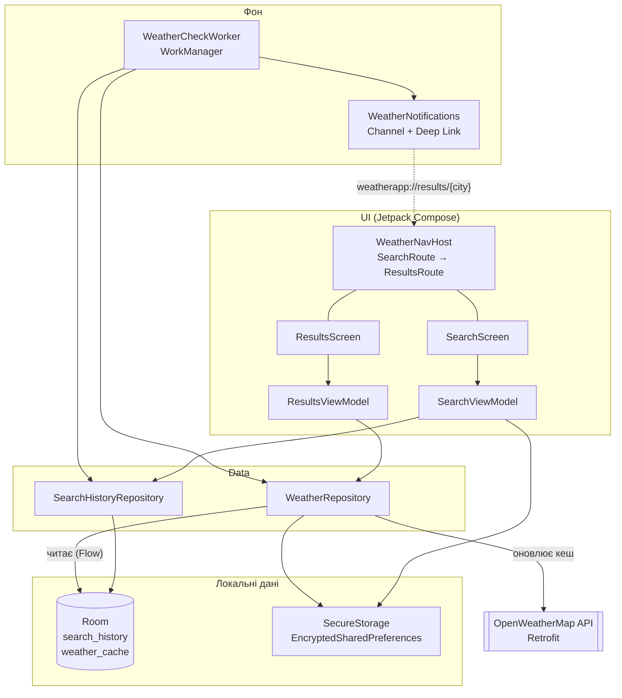

# 🌤 Weather App

Android-застосунок прогнозу погоди на **Kotlin + Jetpack Compose**.
Індивідуальний проєкт курсу «Розробка програмного забезпечення під мобільні платформи» (тема «Погода», трек Kotlin).

## Можливості

- Пошук погоди за назвою міста з валідацією вводу
- Поточна погода: температура, «відчувається як», вологість, вітер, тиск
- Прогноз на добу (кожні 3 години) з імовірністю опадів
- Історія останніх 5 міст, що оновлюється автоматично
- **Offline-First**: без інтернету показується останній збережений прогноз
- API-ключ OpenWeatherMap у **зашифрованому сховищі**
- Фонова перевірка кожні 3 години та сповіщення **«🌧 Сьогодні дощ!»**; клік відкриває екран міста
- Material 3, світла й темна тема, анімовані переходи між екранами

## Технології

| Шар | Бібліотеки |
|---|---|
| UI | Jetpack Compose, Material 3 |
| Навігація | Navigation Compose 2.9 (Type-Safe `@Serializable` маршрути, deep links) |
| Стан | ViewModel + `StateFlow`, `collectAsStateWithLifecycle` |
| Мережа | Retrofit 2 + kotlinx.serialization, OpenWeatherMap API |
| Локальна БД | Room + Flow (KSP) |
| Безпека | EncryptedSharedPreferences (AES-256), Android Keystore |
| Фон | WorkManager (`CoroutineWorker`, `PeriodicWorkRequest`) |
| Тести | JUnit4, MockK, kotlinx-coroutines-test |

## Архітектура

MVVM + Repository. Room є **єдиним джерелом правди** (Single Source of Truth): екран завжди читає дані з бази, а мережа лише оновлює базу.



### Потік даних на екрані результатів

1. `ResultsViewModel` підписується на `WeatherRepository.observeWeather(city)`, тобто на Flow з Room.
2. Паралельно викликає `refresh(city)`: Retrofit тягне `/weather` та `/forecast` і записує результат у Room.
3. Room сам надсилає оновлені дані у Flow, і UI перемальовується.
4. Якщо мережі немає, `refresh` повертає помилку, але на екрані лишаються кешовані дані з плашкою «Немає з'єднання».

## Структура проєкту

```
app/src/main/java/com/example/weatherapp/
├── MainActivity.kt            # точка входу, запит дозволу на сповіщення
├── WeatherApplication.kt      # AppContainer, канал сповіщень, планування фону
├── data/
│   ├── AppContainer.kt        # ручний DI
│   ├── SearchHistoryRepository.kt
│   ├── WeatherRepository.kt   # Offline-First
│   ├── local/                 # Room: Entity, DAO, Database (+ міграція 1→2)
│   ├── remote/                # Retrofit API, DTO, мапери
│   ├── secure/                # EncryptedSharedPreferences
│   └── model/                 # моделі для UI
├── notifications/             # Notification Channel, PendingIntent
├── work/                      # WorkManager: Worker і планувальник
└── ui/
    ├── navigation/            # Type-Safe маршрути, NavHost, анімації
    ├── screens/               # екрани та ViewModel
    ├── components/            # Shimmer
    └── theme/                 # палітра «небо», Material 3
```

## Запуск

1. Відкрити проєкт в Android Studio, дочекатися Gradle Sync.
2. Запустити на емуляторі або телефоні (Android 7.0+, API 24).
3. Отримати безкоштовний ключ на [openweathermap.org](https://home.openweathermap.org/api_keys).
4. У застосунку натиснути ⚙ і вставити ключ. Він зберігається лише на пристрої, у зашифрованому вигляді, і ніколи не потрапляє в код.

## Тести

Unit-тести лежать у `app/src/test/`. Запуск: правий клік на папці `test` → **Run 'Tests in weatherapp'**, або з терміналу:

```bash
./gradlew testDebugUnitTest
```

| Тест | Що перевіряє |
|---|---|
| `WeatherRepositoryTest` | без ключа мережа не викликається; успіх записує кеш; помилка мережі не чіпає кеш; мапінг кешу в модель |
| `SearchHistoryRepositoryTest` | нормалізація назв, порядок історії, видалення |
| `WeatherMappersTest` | DTO → Entity → модель, JSON прогнозу, захист від пошкодженого JSON |
| `SearchViewModelTest` | реактивна історія, збереження та видалення API-ключа |
| `ResultsViewModelTest` | стани успіх / офлайн з кешем / 404 / 401 / без ключа, повторне оновлення |

Залежності підмінено mock-об'єктами MockK, а `Dispatchers.Main` замінено тестовим диспетчером (`MainDispatcherRule`).

## Лабораторні роботи

| Лаба | Тема | Git-тег |
|---|---|---|
| 1 | Базовий UI, Material 3, `Rules.md` | `lab-1` |
| 2 | Type-Safe навігація, slide-in анімація | `lab-2` |
| 3 | Room (історія), EncryptedSharedPreferences | `lab-3` |
| 4 | Retrofit, Offline-First, shimmer | `lab-4` |
| 5 | WorkManager, сповіщення, deep link | `lab-5` |
| 6 | Unit-тести (MockK), README | `lab-6` |

Правила для AI-асистента описано в [`Rules.md`](Rules.md).
